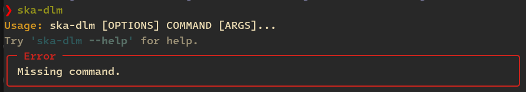
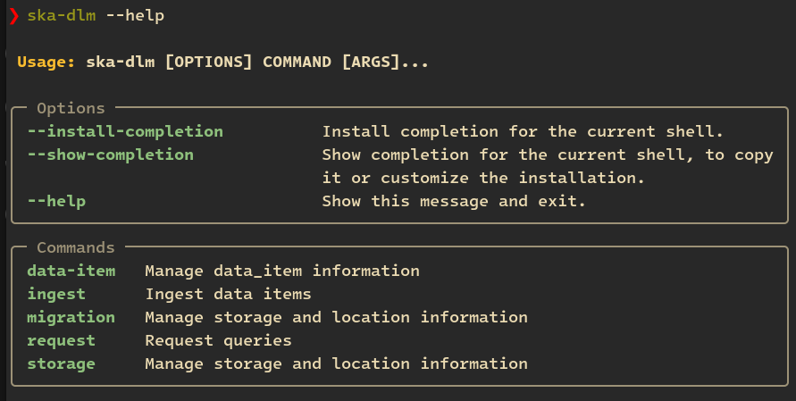
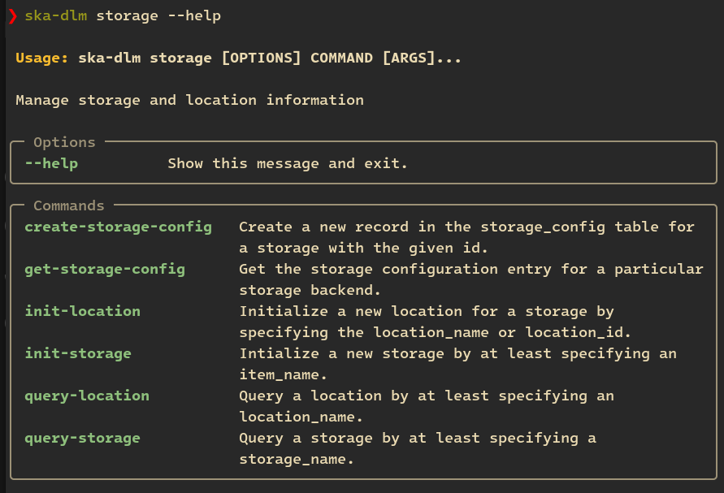
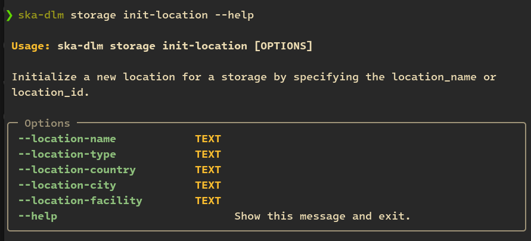

.. _cli api:

Command Line Interface
----------------------

The SKA-DLM provides a concise command line interface (CLI) implemented using the `typer package <https://typer.tiangolo.com>`_. After installation the CLI is available as a hierarchical command interface simply starting with:

.. code:: bash

    > ska-dlm

The output of which looks like:

As can be seen the CLI features highlighting and on-line help:

Typer also provides command line completion and those are the two first options shown along with the ``--help`` option. Just to show a couple more examples of the help hierarchy for the storage manager.

This is showing the available sub-commands of ``ska-dlm storage``:

The following is showing the actual command options for the ``ska-dlm storage init-location`` command:

All options of the SKA-DLM can be explored and used in this way. See :ref:`Command Line Interface <local-development-cli>` for a full example.
