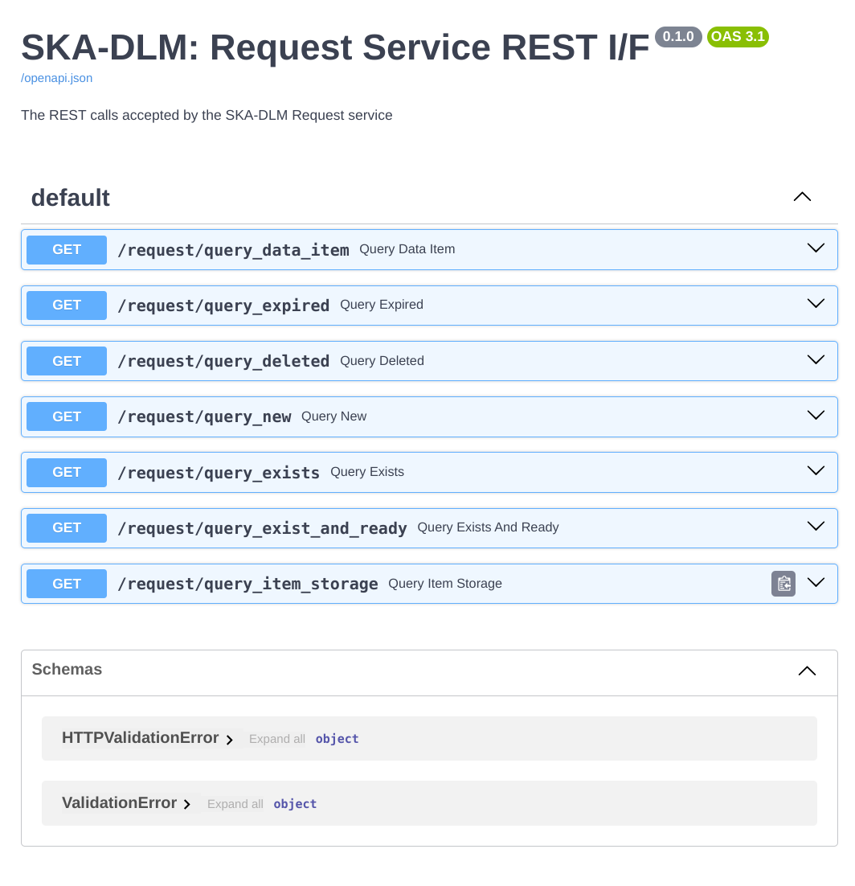

.. _rest api:

RESTful
-------
As described in the overview, the SKA-DLM is exposing all the managers and their relevant functions through REST interfaces served through a `FastAPI <https://fastapi.tiangolo.com>`_ server. The REST calls are protected through a AAA API gateway connecting to an organisation wide AAA system. Both are external services in operations, but we have implemented a gateway and are using a Keycloak AAA system for testing and evaluation of the system. Since we are using FastAPI, the documentation of the available REST calls is autogenerated at run-time and available on the same URLs as the managers' URLs. For the local evaluation setup these are:

- http://localhost:8000/docs for the AAA API gateway
- http://localhost:8001/docs for the Ingest Manager REST I/F
- http://localhost:8002/docs for the Request Manager REST I/F
- http://localhost:8003/docs for the Storage Manager service REST I/F
- http://localhost:8004/docs for the Migration Manager REST I/F

As an example the Request Manager REST page looks like this:

Request
^^^^^^^

.. openapi:: _openapi/request.yaml

Ingest
^^^^^^

.. openapi:: _openapi/ingest.yaml

Storage
^^^^^^^

.. openapi:: _openapi/storage.yaml

Migration
^^^^^^^^^

.. openapi:: _openapi/migration.yaml
