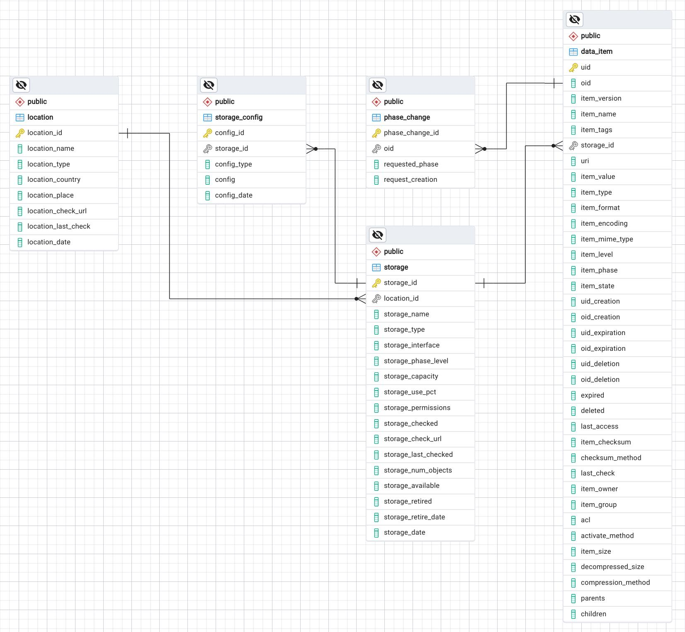

Overview
========
The SKA Data Lifecycle Management system provides the SKAO with the means to register, trace, query, retrieve and also move, copy and delete data of any type on the storage volumes managed by this system. Its focus is on the data lifecycle management part, not the management of domain specific metadata. Storage volumes in general are assumed to be geographically distributed as well as featuring a range of different access mechanisms, for example local POSIX file systems and S3-compliant object stores in some remote private or public cloud environment. The system has been designed to be flexible and scalable, but in the current state it is far from a complete solution and has also not been used in operations, yet. The SKA-DLM design is loosely based on previous experience with implementing and operating the `Next Generation Archive System  (NGAS) <https://github.com/ICRAR/NGAS>`_. However, the implementation is completely independent and it also adds the focus on lifecycle management, rather than just final persistent archive like NGAS.

As outlined in the `design <https://confluence.skatelescope.org/display/SE/YAN-1589+%28SP-3809%29%3A+Design+of+Bulk+Data+product+Ingest+Service>`_, DLM consists of five main services (managers):

  - DLM Ingest Manager
  - DLM Storage Manager
  - DLM Migration Manager
  - DLM Request Manager
  - DLM DB

These managers are bound together by a 'hidden' service, which is DLM database. For operations, the DB engine is assumed to be provided, maintained and operated by other SKAO teams (and trains), but for the testing and evaluation a DB is installed and started locally. As a system the first thing which has to be up and running is the DLM DB. In operations this will require a High Avaliability Database setup and the load on this DB will be quite substantial. Actual numbers are dependent on the kind of data products from all over the organisation, which will eventually be managed by DLM. There is now a process in place to collect such information.

DLM is designed to accept arbitrary types and categories of data. It also allows to register and track relationships between data items. The most important features are centred around the management of the lifecycle and resilience of data items as well as the distribution over and across multiple, geographically distributed storage volumes featuring heterogenous performance and interface characteristics. The SKA-DLM initially targets posix based file systems as well as S3 storage. The end-user (or system) does not need to know any of the details of these storage volumes or even their existence. This separation will also allow the operators to add new types of volumes and remove retired or broken ones. Such functionality is foreseen and reflected by the DLM DB schema, but some of the functionality is not yet implemented.

The DLM DB service included with the code is not intended to be used in an operational deployment, but the DLM system will be a client of the observatory wide DB setup. The DLMingest and DLMrequest services are the main input and output services, respectively exposed to other subsystems and users. This requires APIs for subsystems and at least administrator and operator level user interfaces. Apart from a future Request Manager interface, end-users are not expected to access or use DLM directly. One of the early user interfaces is the SKA Data Product Dashboard.

Please also refer to the DLM design description: https://confluence.skatelescope.org/x/rCYLDw

The implementation structures the code accordingly into the following sub-modules:

  - ``data_item``, setter and update functions
  - ``dlm_db``, DB maintenance functions (currently empty)
  - ``dlm_ingest``, data_item ingest and initialization functions
  - ``dlm_migration``, migration and copy functions
  - ``dlm_request``, query functions
  - ``dlm_storage``, location and storage initialization, configuration and query functions as well as data_item payload deletion.

With exception of the ``dlm_db`` and the ``data_item`` modules these are currently implemented as FastAPI libraries and can be used through direct REST calls as well as by using the provided python function calls. All the managers are running their own FastAPI daemon.

The Data Item Module
--------------------
This module collects all the setter and updating functions related to the data_item table in a separate module to avoid cyclic imports. It is not exposed through REST directly but the functions are called from the managers.

The DLM DB
----------
The current implementation is built around the DB schema shown in the figure below. The DB also implements a number of triggers, functions and foreign key relationships with associated constraints to keep the content consistent. Many of the columns of the tables have default values and are not mandatory (at least for early operations).

The metadata in the DLM DB is focussing on the requirements of the data management. By design it does not directly include the product specific metadata. If required, such metadata will need to be defined and collected in separate, but closely related DBs, such as the one implemented by the Data Product Dashboard. The link between the DLM metadata and the product specific metadata is the OID and the item_name. DLM allows for a plugin system to extract and synchronize such metadata during ingest. The DLM DB has been implemented in PostgreSQL, but we also have a schema for the Yugabyte DB. Unfortunately the Yugabyte schema is not exactly the same due to some differences between the two.

The DLM DB REST Server
^^^^^^^^^^^^^^^^^^^^^^
On top of the DB we are running a `postgREST server <https://docs.postgrest.org/en/v12/>`_, which connects to the DB and exposes a very complete RESTful interface. This postgREST intermediate layer is not strictly required, but makes the internal implemenation very homogenous, since it is using HTTP based requests almost everywhere. If the overhead turns out to be prohibitive, we will replace those calls with direct SQL calls.

The DLM Ingest Manager Module
-----------------------------
The current implementation of the DLM-IngestManager is a FastAPI based registration service for data_items and does not deal with the actual data directly. In the DLM design we introduce the DLM data_item. A DLM data_item is an entity consisting of the metadata and the payload, which is the actual data. During ingest the DLM-IngestManager does not touch the payload (aka data product), but only a reference to it (URI column) is registered in the DLM DB. The ingest activity makes the payload visible to the DLM system and enables DLM to manage the lifecycle. The ingest process also assigns the internal unique IDs (OID and UID) to the data_item and sets a number of other DLM properties, like the expiration times, the state and the phase. A typical ingest process consists of the following steps:

  #. Initialisation of the data_item using *init_data_item*
  #. Writing of the data payload *independently* from the DLM system using whatever is required by the application or system producing the data.
  #. Setting of the URI pointing to the payload using *set_uri*
  #. Setting of the 'ready' state using *set_state*

Steps 1 and 2 are interchangeable since the writing is totally independent from the DLM system. The last step *needs* to be the final step in order to ensure that the data_item is really finished.

Functions exposed:
  - ingest_data_item, given an item_name, a path to a payload and a storage_id register a new data_item and transition to 'ready' state.
  - init_data_item, given an item_name and optionally additional meta-data items initialize a new data_item.

The DLM Storage Manager Module
------------------------------
This is a FastAPI-based service and is implementing the storage manager logic. Currently it is implementing the following functionality:

  #. delete_data_item_payload, Delete expired data_item payloads and setting the state to DELETED.
  #. Produce a copy of newly ingested data_items to one more configured storage backend. This is using the copy_data_item function of the dlm_migration module.
  #. Stub for handling a phase change heuristic engine.
  #. Stub for handling capacity based data movements.

The storage manager exposes a number of storage related functions and is also running a background daemon, (currently) polling the DB using some of the functions provided by the request manager module in intervals to retrieve lists of expired and newly ingested data_items, respectively and then use the delete and copy functions to act accordingly. The future implementations of the phase change and capacity engines will use the same functions as well to free up space on storage volumes running low in capacity, while still making sure that the required persistence level (phase) is maintained. In addition to the daemon functionality the storage manager module also exposes some of its internal functions.

The DLM Migration Manager Module
--------------------------------
This manager is also a FastAPI based daemon. Currently we have chosen to use rclone running in server mode to provide this functionality. However, the DLM system allows to plugin other migration services as well. It is also possible to use multiple ones to cover specific requirements for certain storage backends. rclone is extremely versatile and will hopefully cover our needs for the most part, at least in the early stages. Whether it is performant enough to copy/move many PB of data across the globe has to be verified. In addition to the rclone functionality the DLM module exposes two functions:

  - copy_data_item, the high level function to copy a data_item from one storage volume to another. This function integrates all the required lower level function calls and checks.
  - rclone_copy, the lowest level copy function, directly calling the rclone server. In future versions this function will not be exposed directly anymore.

The DLM Request Manager Module
------------------------------
The current implementation of this FastAPI based manager is limited to a number of convenience methods focusing on the required DB queries for the other DLM managers rather than any external users or systems. Eventually this will expose a web-based request handling and packaging system to support users or other systems requesting data to be delivered to their chosen endpoints. The currently exposed functions include:

  - query_data_item, generic function to query the data_item table.
  - query_exists, checks for the existence of a data_item identified by an item_name, OID or UID.
  - query_exists_and_ready, same as above, but only returns data_items if they are in 'ready' state.
  - query_expired, returns all expired data_items given a datetime.
  - query_item_storage, returns a list of all storage volumes containing a copy of a data_item identified by an item_name, OID or UID.

Interfaces
----------
The SKA-DLM provides four different ways of interacting with it, which can be used in different scenarios.

    - An independent `ska-dlm-client package <https://gitlab.com/ska-telescope/ska-dlm-client/>`_, which provides the most transparent way of registering data with the DLM.
    - A python library, exposing plain python functions (see :ref:`python api`).
    - A Command Line Interface (CLI) (see :ref:`cli api`).
    - REST interfaces to each of the managers (see :ref:`rest api`).